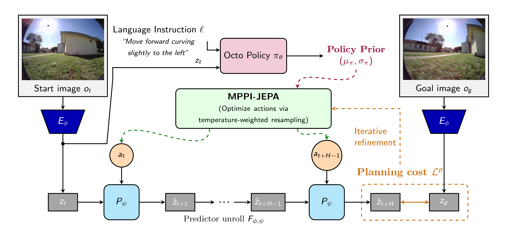

# PiJEPA: Policy-Guided World Model Planning for Language-Conditioned Visual Navigation

This repository contains the code for reproducing the experiments in the [PiJEPA paper](https://arxiv.org/abs/2603.25981). PiJEPA combines policy-guided planning with JEPA-based world models for language-conditioned visual navigation.

## Overview

PiJEPA leverages:
- **Octo Policy**: A generalist robotic policy fine-tuned on the CAST dataset
- **JEPA World Models**: Latent world models using DINOv2 or V-JEPA-2 encoders
- **MPPI Planning**: Model Predictive Path Integral for action optimization



## Installation

```bash
# Create conda environment
conda create -n pijepa python=3.10
conda activate pijepa

# Install dependencies
pip install -e .
pip install -r requirements.txt
pip install torch torchvision
pip install accelerate
```

### JEPA World Models Setup

Clone and setup the JEPA-WMS library (required for world model training):

```bash
cd jepa_wms
pip install -e .
```

## Dataset

We use the [CAST dataset](https://huggingface.co/datasets/catglossop/CAST-dataset) for training and evaluation.

```python
hf download catglossop/CAST-dataset --repo-type=dataset --local-dir ./CAST-dataset
# Data path should be configured in the config files
```

## Training

### 1. Fine-tune Octo Policy on CAST

**With DINOv2 encoder:**
```bash
torchrun --nproc_per_node 4 scripts/finetune_cast_dino.py --config scripts/configs/finetune_cast_dino_config.py
```

**With V-JEPA-2 encoder:**
```bash
torchrun --nproc_per_node 4 scripts/finetune_cast_vjepa.py --config scripts/configs/finetune_cast_vjepa_config.py
```

### 2. Train World Model

**DINOv2 World Model (curriculum training):**
```bash
# Stage 1: rollout_steps=1, 15k steps
torchrun --nproc_per_node 4 scripts/train_cast_wm.py --encoder dino

# Stage 2: rollout_steps=3, +10k steps
torchrun --nproc_per_node 4 scripts/train_cast_wm.py --encoder dino \
    --resume <checkpoint_step15000.pt> --rollout_steps 3 \
    --batch_size 8 --num_steps 25000 --lr 5e-5 --skip_optimizer_state

# Stage 3: rollout_steps=7, +15k steps
torchrun --nproc_per_node 4 scripts/train_cast_wm.py --encoder dino \
    --resume <checkpoint_step25000.pt> --rollout_steps 7 \
    --batch_size 8 --num_steps 40000 --lr 5e-5 --skip_optimizer_state
```

**V-JEPA-2 World Model:**
```bash
# Follow similar curriculum as DINOv2
torchrun --nproc_per_node 4 scripts/train_cast_wm.py --encoder vjepa
```

## Evaluation

Evaluate the trained models with MPPI planning:

```bash
bash run_eval_dino_vjepa.sh
```

Or run individual evaluations:

```bash
python scripts/eval_octo_wm_plan.py \
    --encoder_type dino \
    --wm_checkpoint <path_to_wm_checkpoint> \
    --octo_ckpt_dir <path_to_octo_checkpoint> \
    --planner_types octo_mean \
    --num_examples 1000
```

## Project Structure

```
PiJEPA/
├── octo/                      # Octo policy implementation (PyTorch)
│   ├── model/                 # Model architectures
│   │   └── components/        # DINOv2, V-JEPA encoders, etc.
│   ├── data/                  # Data loading and transforms
│   └── utils/                 # Training utilities
├── jepa_wms/                  # JEPA world model (from facebookresearch/jepa-wms)
├── scripts/                   # Training and evaluation scripts
│   ├── configs/               # Configuration files
│   ├── finetune_cast_dino.py  # Fine-tune Octo with DINOv2
│   ├── finetune_cast_vjepa.py # Fine-tune Octo with V-JEPA-2
│   ├── train_cast_wm.py       # Train world model
│   └── eval_octo_wm_plan.py   # Evaluation with MPPI
├── train_dino_wm.sh           # DINOv2 world model training script
├── train_vjepa_wm.sh          # V-JEPA world model training script
└── run_eval_dino_vjepa.sh     # Evaluation script
```

## Acknowledgements

This codebase builds upon:
- [Octo-PyTorch](https://github.com/emb-ai/octo-pytorch) - PyTorch implementation of Octo
- [JEPA-WMS](https://github.com/facebookresearch/jepa-wms) - JEPA world models
- [CAST Dataset](https://huggingface.co/datasets/catglossop/CAST-dataset) - Navigation dataset

## Citation

If you find this work useful, please cite:

```bibtex
@misc{chahe2026policyguidedworldmodelplanning,
      title={Policy-Guided World Model Planning for Language-Conditioned Visual Navigation}, 
      author={Amirhosein Chahe and Lifeng Zhou},
      year={2026},
      eprint={2603.25981},
      archivePrefix={arXiv},
      primaryClass={cs.RO},
      url={https://arxiv.org/abs/2603.25981}, 
}
```

## License

This project is licensed under the MIT License - see the [LICENSE](LICENSE) file for details.
